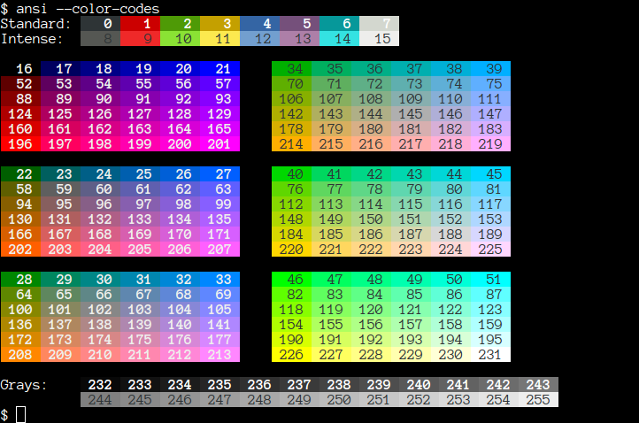

ANSI Code Generator
===================

This bash script will generate the proper ANSI escape sequences to move the cursor around the screen, make text bold, add colors and do much more.  It is designed to help you colorize words and bits of text.

If it helps, you can think of it as a curses / ncurses library for bash, or a tool that helps you using tricks from DOS's ANSI.SYS.  Or you might consider this to be your magic highlighter that has always been missing from bash.

Demonstrations
--------------

### Colors

### --color-table

### --color-codes

Installation
------------

Download `ansi` and put it somewhere in your path.  Make sure that it is executable (`chmod a+x ansi` works well).  Bash will need to be present, but it is often installed by default.  No external commands are used; this only uses bash's built-in features.

    # Download
    curl -OL git.io/ansi

    # Make executable
    chmod 755 ansi

    # Copy to somewhere in your path
    sudo mv ansi /usr/local/bin/

Not all features will work with all terminals.  Your terminal determines if particular codes work.
You can override the terminal detection logic and force `ansi` to output color codes with the environment variable `ANSI_FORCE_SUPPORT` set to any non-empty value.

### [BPM] Installation

This package is also published as a [BPM] library. This means it can be loaded into other scripts or installed easily. The `ansi` library does not need any dependencies from BPM in order to work.

To use this as a standalone command, first install [BPM] and then run: `bpm install ansi`

To use this as a library, list `ansi` as a dependency in your `bpm.ini` file and include these lines at the top of your shell script:

    . bpm
    bpm::include ansi

Once loaded into the environment, the list of library functions below are available for your use.

Upgrading Issues
----------------

The newer version of `ansi` has reversed an earlier decision about newlines at the end.  Previously, calling `ansi test` would write "test" to the screen without a newline and `ansi -n test` would add a newline. As of August 2018, this has switched and `ansi test` will write out "test" with a newline. The `-n` flag is also switched. Sorry for the inconvenience that the earlier decision has caused and future confusion due to this flag switching. The goal is to align more closely with `echo`.

Usage
-----

    ansi [OPTIONS] [TEXT TO DISPLAY]

The OPTIONS are numerous and are detailed below.  You can specify as many as you like.  Option processing stops at the first unknown option and at `--`.  Options are applied in the order specified on the command line.  Colors are reset and attributes are restored to default unless `--no-restore` is used.

Examples
--------

It often helps when one can see how to use a new tool, so here's how this library can be used.

### Command-Line

    # Write "Tests pass" in green on its own line
    ansi --green --newline "Tests pass"

    # Change the terminal's title to the working directory and
    # do not write anything to the terminal.
    ansi --title="$(pwd)" --no-newline

    # Reset the terminal colors, reset to the default font, move the cursor
    # to row 1 column 1, and show the cursor if it was previously hidden.
    # This long line is the same as the --reset option.
    ansi --erase-display=2 --position=1,1 --show-cursor \
        --reset-font --reset-color

    # Find out how many lines the terminal can display
    ansi --report-window-chars | cut -d , -f 1

Need more?  Check out the [examples/](examples/) folder.

Command-Line Options
--------------------

When using the `ansi` command from a shell script or a prompt, there are a plethora of different options you can use. The syntax for using these options is as follows:

    ansi [OPTIONS] [TEXT TO DISPLAY]

All options must be placed first. See the Examples section for more information. You can also see the entire list of options by running `ansi --help`.

### Display Manipulation

The short version of these options comes from the command they are implementing.

* `--insert-chars[=N]`, `--insert-char[=N]`, `--ich[=N]` - Insert blanks at cursor, shifting the line right.
* `--erase-display[=N]`, `--ed[=N]` - Erase in display. 0=below, 1=above, 2=all, 3=saved.
* `--erase-lines[=N]`, `--erase-line[=N]`, `--el[=N]` - Erase in line. 0=right, 1=left, 2=all.
* `--insert-lines[=N]`, `--insert-line[=N]`, `--il[=N]`
* `--delete-lines[=N]`, `--delete-line[=N]`, `--dl[=N]`
* `--delete-chars[=N]`, `--delete-char[=N]`, `--dch[=N]`
* `--scroll-up[=N]`, `--su[=N]`
* `--scroll-down[=N]`, `--sd[=N]`
* `--erase-chars[=N]`, `--erase-char[=N]`, `--ech[=N]`
* `--repeat[=N]`, `--rep[=N]` - Repeat preceding character N times.

### Cursor

The short version of these options comes from the command they are implementing.

* `--up[=N]`, `--cuu[=N]`
* `--down[=N]`, `--cud[=N]`
* `--forward[=N]`, `--cuf[=N]`
* `--backward[=N]`, `--cub[=N]`
* `--next-line[=N]`, `--cnl[=N]`
* `--previous-line[=N]`, `--prev-line[=N]`, `--cpl[=N]`
* `--column[=N]`, `--cha[=N]`
* `--position[=[ROW],[COL]]`, `--cup[=[ROW],[COL]]`
* `--tab-forward[=N]` - Move forward N tab stops.
* `--tab-backward[=N]` - Move backward N tab stops.
* `--column-relative[=N]`, `--hpr[=N]`
* `--line[=N]`, `--vpa[=N]`
* `--line-relative[=N]`, `--vpr[=N]`
* `--save-cursor` - Saves the cursor position.  By default, this will restore the cursor after writing text to the terminal unless you use `--no-restore`.
* `--restore-cursor` - This just restores the cursor position.  Normally this executes at the end when you use `--save-cursor`.
* `--hide-cursor` - This also will show the cursor at the end unless you use `--no-restore`.
* `--show-cursor`

### Text (Attributes)

All of these options will automatically reset to normal text unless `--no-reset` is used. Below, the codes are grouped into similar functionality and the flag to disable that attribute is listed with the group it controls, so you can correlate the flags more easily.

* `--bold` and `--faint` can be reset with `--normal`
* `--italic` and `--fraktur` can be reset with `--plain`
* `--underline` and `--double-underline` are reset with `--no-underline`
* `--blink` and `--rapid-blink` are reset with `--no-blink`
* `--inverse` is removed with `--no-inverse`
* `--invisible` is changed back with `--visible`
* `--strike` is reset with `--no-strike`
* `--frame` and `--encircle` are reset with `--no-border`
* `--overline` is removed with `--no-overline`
* `--ideogram-right`, `--ideogram-right-double`, `--ideogram-left`, `--ideogram-left-double`, and `--ideogram-stress` are all removed with `--reset-ideogram`
* `--font=NUM` sets the font. `NUM` must be a single digit from 0 through 9. Font 0 is the default font.

### Text (Foreground)

All of these options will automatically reset to the default color unless `--no-reset` is used. To preview the colors, use `--color-table`.

* `--black` and `--black-intense`
* `--red` and `--red-intense`
* `--green` and `--green-intense`
* `--yellow` and `--yellow-intense`
* `--blue` and `--blue-intense`
* `--magenta` and `--magenta-intense`
* `--cyan` and `--cyan-intense`
* `--white` and `--white-intense`
* `--color=CODE` lets you use one of 256 codes - preview the codes using `--color-codes`
* `--rgb=R,G,B` sets a specific color

### Text (Background)

All of these options will automatically reset to the default color unless `--no-reset` is used. To preview the colors, use `--color-table`.

* `--bg-black` and `--bg-black-intense`
* `--bg-red` and `--bg-red-intense`
* `--bg-green` and `--bg-green-intense`
* `--bg-yellow` and `--bg-yellow-intense`
* `--bg-blue` and `--bg-blue-intense`
* `--bg-magenta` and `--bg-magenta-intense`
* `--bg-cyan` and `--bg-cyan-intense`
* `--bg-white` and `--bg-white-intense`
* `--bg-color=CODE` lets you use one of 256 codes - preview the codes using `--color-codes`
* `--bg-rgb=R,G,B` sets a specific color

### Text (Reset)

These options force a reset of colors.  This is useful if you used `--no-reset` or are correcting the appearance of a misbehaving terminal.

* `--reset-attrib` - Reset all attributes
* `--reset-foreground` - Reset the foreground to default
* `--reset-background` - Reset the background to default
* `--reset-color` - Reset all color-related settings
* `--reset-font` - Reset the font to the primary font

### Reporting

All of these commands send a special code to the terminal.  The terminal responds as though someone typed something very fast.  In order for these to work, `ansi` must read from stdin directly.  This won't work if you are piping in a file or replace stdin in another way.

The ANSI codes are written to stdout in order that the terminal might respond immediately. The result of the report is written to stdout.

* `--report-position` - ROW,COL
* `--report-window-state` - "open" or "iconified"
* `--report-window-position` - X,Y
* `--report-window-pixels` - HEIGHT,WIDTH
* `--report-window-chars` - ROWS,COLS
* `--report-screen-chars` - ROWS,COLS (this is for the entire screen)
* `--report-icon`
* `--report-title`

### Miscellaneous

* `--color-table` - Display a color table.
* `--color-codes` - Show all of the 256 color codes.
* `--icon=NAME` - Set the icon.
* `--title=TITLE` - Set the title of the terminal.
* `--no-restore` - Do not issue reset codes when changing colors and saving the cursor.  For example, if you use `--green` then the text will automatically be reset to the default color when the command terminates.  With `--no-restore` set, the text will stay green and subsequent commands that output will keep writing in green until something else changes the terminal.
* `-n`, `--no-newline` - Do not add a newline at the end.
* `--bell` - Add the terminal's bell sequence to the output.
* `--reset` - Reset all colors, clear the screen, show the cursor, restore the primary font, and move to 1,1.

Library Functions
-----------------

If you decide to leverage `ansi` as a Bash library and you load its functions into your environment, you gain access to the following functions. You will notice that they, for the most part, mirror the option names of the command-line program. These functions only do their one task and do not reset the terminal when done. Any exceptions to this are clearly called out.

In order to source `ansi` into the environment you will have to use one of a few different methods.

Loading via [BPM], after you add `ansi` to your dependencies in your `bpm.ini` file.

    . bpm
    bpm::include ansi

Loading when `ansi` is installed manually into your path somewhere. Coincidentally, this also works when you use [BPM] to install the tool globally.

    . ansi

Loading when you include `ansi` in your project.

    . path/to/the/file/ansi

When using this to change the color or perform terminal manipulation, make sure to send the reset codes.

    ansi::green
    echo "This is green text"

    # You must manually reset the colors
    ansi::resetForeground

All of the functions write to stdout except `ansi::report`. That one uses stderr to query the terminal and its result will go into the `ANSI_REPORT` environment variable.

None of the functions care if the terminal supports ANSI unless otherwise noted. They will happily write out ANSI codes even if the terminal will not recognize them.

### Display Manipulation

The short version of these options comes from the command they are implementing.

* `ansi::insertChars` - Inserts blanks at the cursor, shifting the line right. Takes an optional argument for the number of characters.
* `ansi::eraseDisplay` - Takes an optional argument where `0` is below, `1` is above, `2` is all, and `3` is saved.
* `ansi::eraseLine` - Erase within a line. Takes an optional argument where `0` is right, `1` is left, and `2` is all.
* `ansi::insertLines` - Inserts lines at the cursor. Takes an optional argument for the number of lines.
* `ansi::deleteLines` - Takes an optional argument for the number of lines.
* `ansi::deleteChars` - Takes an optional argument for the number of characters.
* `ansi::scrollUp` - Takes an optional argument for the number of lines.
* `ansi::scrollDown` - Takes an optional argument for the number of lines.
* `ansi::eraseChars` - Takes an optional argument for the number of characters.
* `ansi::repeat` - Takes an optional argument for the number of times to repeat the preceding character.

### Cursor

The short version of these options comes from the command they are implementing.

* `ansi::up` - Moves the cursor up. Takes an optional argument for the number of lines.
* `ansi::down` - Moves the cursor down. Takes an optional argument for the number of lines.
* `ansi::forward` - Moves the cursor forwards. Takes an optional argument for the number of characters.
* `ansi::backward` - Moves the cursor backwards. Takes an optional argument for the number of characters.
* `ansi::nextLine` - Takes an optional argument for the number of lines.
* `ansi::previousLine` - Takes an optional argument for the number of lines.
* `ansi::column` - Moves to a column. Takes an optional argument for which column.
* `ansi::position` - Moves to a specific position. Takes an optional argument for the rows and columns in the format `R,C`. Both the row and the column are also optional.
* `ansi::tabForward` - Moves forward a number of tab stops. Takes an optional argument for the number of tab stops.
* `ansi::tabBackward` - Moves backward a number of tab stops. Takes an optional argument for the number of tab stops.
* `ansi::columnRelative` - Moves the cursor left or right a number of columns. Takes an optional argument for the number of columns.
* `ansi::line` - Moves the cursor to a specific line. Takes an optional argument for the line number.
* `ansi::lineRelative` Moves the cursor up or down a number of lines. Takes an optional argument for the number of lines.
* `ansi::saveCursor` - Saves the cursor position.
* `ansi::restoreCursor` - Restores the cursor position.
* `ansi::hideCursor` - Makes the cursor invisible.
* `ansi::showCursor` - Restores the normal cursor to the screen.

### Text (Attributes)

All of these options will automatically reset to normal text unless `--no-reset` is used. Below, the codes are grouped into similar functionality and the flag to disable that attribute is listed with the group it controls, so you can correlate the flags more easily.

* `ansi::bold` and `ansi::faint` can be reset with `ansi::normal`
* `ansi::italic` and `ansi::fraktur` can be reset with `ansi::plain`
* `ansi::underline` and `ansi::double-underline` are reset with `ansi::noUnderline`
* `ansi::blink` and `ansi::rapidBlink` are reset with `ansi::noBlink`
* `ansi::inverse` is removed with `ansi::noInverse`
* `ansi::invisible` is changed back with `ansi::visible`
* `ansi::strike` is reset with `ansi::noStrike`
* `ansi::frame` and `ansi::encircle` are reset with `ansi::noBorder`
* `ansi::overline` is removed with `ansi::noOverline`
* `ansi::ideogramRight`, `ansi::ideogramRightDouble`, `ansi::ideogramLeft`, `ansi::ideogramLeftDouble`, and `ansi::ideogramStress` are all removed with `ansi::resetIdeogram`
* `ansi::font` sets the font. It takes an optional argument that must be a single digit from 0 through 9. Font 0 is the default font.

### Text (Foreground)

All of these options will automatically reset to the default color unless `--no-reset` is used. To preview the colors, use `--color-table`.

* `ansi::black` and `ansi::blackIntense`
* `ansi::red` and `ansi::redIntense`
* `ansi::green` and `ansi::greenIntense`
* `ansi::yellow` and `ansi::yellowIntense`
* `ansi::blue` and `ansi::blueIntense`
* `ansi::magenta` and `ansi::magentaIntense`
* `ansi::cyan` and `ansi::cyanIntense`
* `ansi::white` and `ansi::whiteIntense`
* `ansi::color` - Takes a required argument of a color code, which is a number from 0 through 255. Preview the codes using `ansi::colorCodes` or running `ansi --color-codes`.
* `ansi::rgb` - Takes three required arguments of the red, green and blue color values. Each are numbers from 0 through 255.

### Text (Background)

All of these options will automatically reset to the default color unless `--no-reset` is used. To preview the colors, use `--color-table`.

* `ansi::bgBlack` and `ansi::bgBlackIntense`
* `ansi::bgRed` and `ansi::bgRedIntense`
* `ansi::bgGreen` and `ansi::bgGreenIntense`
* `ansi::bgYellow` and `ansi::bgYellowIntense`
* `ansi::bgBlue` and `ansi::bgBlueIntense`
* `ansi::bgMagenta` and `ansi::bgMagentaIntense`
* `ansi::bgCyan` and `ansi::bgCyanIntense`
* `ansi::bgWhite` and `ansi::bgWhiteIntense`
* `ansi::bgColor` - Takes a required argument of a color code, which is a number from 0 through 255. Preview the codes using `ansi::colorCodes` or running `ansi --color-codes`.
* `ansi::bgRgb` - Takes three required arguments of the red, green and blue color values. Each are numbers from 0 through 255.

### Text (Reset)

These options force a reset of colors.  This is useful if you used `--no-reset` or are correcting the appearance of a misbehaving terminal.

* `ansi::resetAttributes` - Reset all attributes
* `ansi::resetForeground` - Reset the foreground to default
* `ansi::resetBackground` - Reset the background to default
* `ansi::resetColor` - Reset all color-related settings
* `ansi::resetFont` - Reset the font to the primary font

### Reporting

All of these commands send a special code to the terminal.  The terminal responds as though someone typed something very fast.  In order for these to work, `ansi` must read from stdin directly.  This won't work if you are piping in a file or replace stdin in another way.

The ANSI codes are written to stdout in order that the terminal might respond immediately. The result of the report is written to stdout.

* `ansi::report` - Helper function to assist with querying the terminal for information. Writes a query to stderr (file descriptor 2), listens for information from stdin (file descriptor 0) and returns the result through the environment variable `ANSI_REPORT`.
* `ansi::reportPosition` - ROW,COL
* `ansi::reportWindowState` - "open" or "iconified"
* `ansi::reportWindowPosition` - X,Y
* `ansi::reportWindowPixels` - HEIGHT,WIDTH
* `ansi::reportWindowChars` - ROWS,COLS
* `ansi::reportScreenChars` - ROWS,COLS (this is for the entire screen)
* `ansi::reportIcon`
* `ansi::reportTitle`

### Miscellaneous

* `ansi::colorTable` - Display a color table.
* `ansi::colorCodes` - Show all of the 256 color codes.
* `ansi::icon` - Set the icon. Takes an optional argument of the icon to set.
* `ansi::title` - Set the title of the terminal.  Takes an optional argument of the title to set.
* `ansi::bell` - Send the bell character to the terminal. The terminal may beep, ding, or produce no sound.
* `ansi::reset` - Reset all colors, clear the screen, show the cursor and move to 1,1.
* `ansi::colorCodes` - Show a table of the available color codes.
* `ansi::colorCodePatch` - Helper function to show a patch of color. Internal use only.
* `ansi::colorTable` - Show a table of the different standard colors, text attributes, and similar things.
* `ansi::colorTableLine` - Helper function to show a line of colors.
* `ansi::isAnsiSupported` - Returns true (0) when ANSI is supported. Tries checking using tools, falls back to querying the terminal.
* `ansi::showHelp` - Shows the help for the `ansi` command.
* `ansi` - This function will act identically to the `ansi` command. Calling `ansi` once the library has been sourced will not spawn a subshell and instead will call functions only, greatly increasing the speed.

When setting the icon and the title, make sure to quote the value correctly so spaces are sent within the argument.

    # This will not work and instead just sets the title to "Tests"
    ansi::title Tests are running

    # This will work because everything is sent as a single argument
    ansi::title "Tests are running"

License
-------

This project is licensed under a MIT style license with an additional non-advertising clause.  See [LICENSE.md](LICENSE.md) for more information.

[BPM]: https://github.com/bpm-rocks/bpm/
