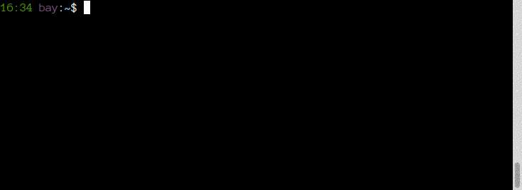
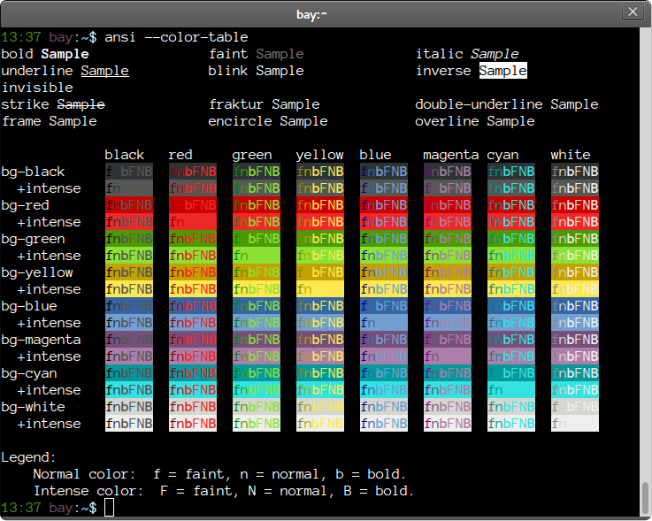

ANSI Code Generator
===================

This bash script will generate the proper ANSI escape sequences to move the cursor around the screen, make text bold, add colors and do much more.  It is designed to help you colorize words and bits of text.

If it helps, you can think of it as a curses / ncurses library for bash, or a tool that helps you using tricks from DOS's ANSI.SYS.  Or you might consider this to be your magic highlighter that has always been missing from bash.

Installation
------------

Download `ansi` and put it somewhere in your path.  Make sure that it is executable (`chmod a+x ansi` works well).  Bash will need to be present, but it is often installed by default.  No external commands are used; this only uses bash's built-in features.

Not all features will work with all terminals.  Your terminal determines if particular codes work.

Usage
-----

    ansi [OPTIONS] [TEXT TO DISPLAY]

The OPTIONS are numerous and are detailed below.  You can specify as many as you like.  Option processing stops at the first unknown option and at `--`.  Options are applied in the order specified on the command line.  When colors are changed, they are removed in reverse order as long as `--no-restore`  is not used.

Examples
--------

Here's a few quick examples to get you started.

    # Write "Tests pass" in green on its own line
    ansi --green --newline "Tests pass"

    # Change the terminal's title to the working directory
    ansi --title="$(pwd)"

    # Reset the terminal colors and move the cursor to row 1 column 1
    # and show the cursor if it was previously hidden.
    # This is the same as the --reset option.
    ansi --erase-display=2 --reset-all --position=1,1 --show-cursor

    # Find out how many lines the terminal can display
    ansi --report-window-chars | cut -d , -f 1

Need more?  Check out the [examples/](examples/) folder.

Options - Display Manipulation
------------------------------

The short version of these options comes from the command they are implementing.

* `--insert-chars[=N]`, `--ich[=N]` - Insert blanks at cursor, shifting the line right.
* `--erase-display[=N]`, `--ed[=N]` - Erase in display. 0=below, 1=above, 2=all, 3=saved.
* `--erase-line[=N]`, `--el[=N]` - Erase in line. 0=right, 1=left, 2=all.
* `--insert-lines[=N]`, `--il[=N]`
* `--delete-lines[=N]`, `--dl[=N]`
* `--delete-chars[=N]`, `--dch[=N]`
* `--scroll-up[=N]`, `--su[=N]`
* `--scroll-down[=N]`, `--sd[=N]`
* `--erase-chars[=N]`, `--ech[=N]`
* `--repeat[=N]`, `--rep[=N]` - Repeat preceding character N times.

Options - Cursor
----------------

The short version of these options comes from the command they are implementing.

* `--up[=N]`, `--cuu[=N]`
* `--down[=N]`, `--cud[=N]`
* `--forward[=N]`, `--cuf[=N]`
* `--backward[=N]`, `--cub[=N]`
* `--next-line[=N]`, `--cnl[=N]`
* `--prev-line[=N]`, `--cpl[=N]`
* `--column[=N]`, `--cha[=N]`
* `--position[=ROW][=COL]`, `--cup[=ROW][=COL]`
* `--tab-forward[=N]` - Move forward N tab stops.
* `--tab-backward[=N]` - Move backward N tab stops.
* `--column-relative[=N]`, `--hpr[=N]`
* `--line[=N]`, `--vpa[=N]`
* `--line-relative[=N]`, `--vpr[=N]`
* `--save-cursor` - Saves the cursor position.  By default, this will restore the cursor after writing text to the terminal unless you use `--no-restore`.
* `--restore-cursor` - This just restores the cursor position.  Normally this executes at the end when you use `--save-cursor`.
* `--hide-cursor` - This also will show the cursor at the end unless you use `--no-restore`.
* `--show-cursor`

Options - Colors (Attributes)
-----------------------------

All of these options will automatically reset to normal text unless `--no-reset` is used.

* `--bold`
* `--faint`
* `--italic`
* `--underline`
* `--blink`
* `--inverse`
* `--invisible`
* `--strike`
* `--fraktur`
* `--double-underline`
* `--frame`
* `--encircle`
* `--overline`

Options - Colors (Foreground)
-----------------------------

All of these options will automatically reset to the default color unless `--no-reset` is used.

* `--black`
* `--red`
* `--yellow`
* `--blue`
* `--magenta`
* `--cyan`
* `--white`
* `--black-intense`
* `--red-intense`
* `--yellow-intense`
* `--blue-intense`
* `--magenta-intense`
* `--cyan-intense`
* `--white-intense`

Options - Colors (Background)
-----------------------------

All of these options will automatically reset to the default color unless `--no-reset` is used.

* `--bg-black`
* `--bg-red`
* `--bg-yellow`
* `--bg-blue`
* `--bg-magenta`
* `--bg-cyan`
* `--bg-white`
* `--bg-black-intense`
* `--bg-red-intense`
* `--bg-yellow-intense`
* `--bg-blue-intense`
* `--bg-magenta-intense`
* `--bg-cyan-intense`
* `--bg-white-intense`

Options - Colors (Reset)
------------------------

These options force a reset of colors.  This is useful if you used `--no-reset` or are correcting the appearance of a misbehaving terminal.

* `--reset-attrib` - Reset all attributes
* `--reset-foreground` - Reset the foreground to default
* `--reset-background` - Reset the background to default
* `--reset-color` - Reset all color-related settings

Reporting
---------

All of these commands send a special code to the terminal.  The terminal responds as though someone typed something very fast.  In order for these to work, `ansi` must read from stdin directly.  This won't work if you are piping in a file or replace stdin in another way.

All output is written to screen.

* `--report-position` - ROW,COL
* `--report-window-state` - "open" or "iconified"
* `--report-window-position` - X,Y
* `--report-window-pixels` - HEIGHT,WIDTH
* `--report-window-chars` - ROWS,COLS
* `--report-screen-chars` - ROWS,COLS (this is for the entire screen)
* `--report-icon`
* `--report-title`

Miscellaneous
-------------

* `--color-table` - Display a color table
* `--icon=NAME` - Set the icon
* `--title=TITLE` - Set the title of the terminal.  The equals (=) before the `TITLE` parameter is mandatory.  `TITLE` can be empty.
* `--no-restore` - Do not issue reset codes when changing colors and saving the cursor.  For example, if you use `--green` then the text will automatically be reset to the default color when the command terminates.  With `--no-restore` set, the text will stay green and subsequent commands that output will keep writing in green until something else changes the terminal.
* `-n`, `--newline` - Add a newline at the end.
* `--escape` - Allow text passed in to contain escape sequences.
* `--reset` - Reset all colors, clear the screen, show the cursor and move to 1,1.

Demonstrations
--------------

### Colors

### --color-table

License
-------

This project is licensed under a MIT style license with an additional non-advertising clause.  See [LICENSE.md](LICENSE.md) for more information.
